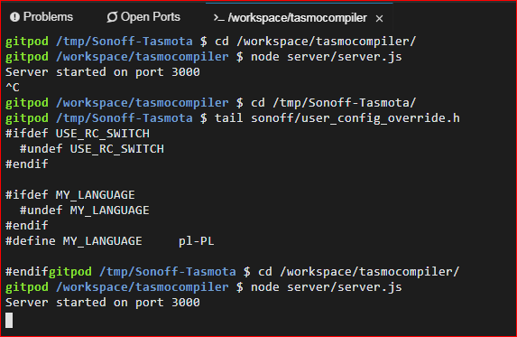
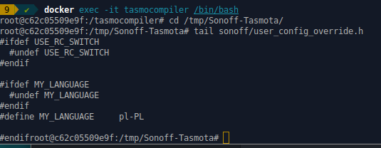

#### Advanced usage
If you want to get access to files created before or after compilation form the console you are able to do this. Source code of Tasmota is located in `/tmp/Sonoff-Tasmota`

##### Gitpod
1. press `ctrl+c` at the gitpod console
2. change directory to `/tmp/Sonoff-Tasmota` by typing `cd /tmp/Sonoff-Tasmota`
3. Now you can check from terminal what for example is the content of `platformio.ini` or `user_config_override.h` files.
4. type this command to see last 10 lines of `user_config_override.h` file:  `tail sonoff/user_config_override.h`
5. start TasmoCompiler again: `cd /workspace/tasmocompiler` and `node server/server.js`

##### Docker
If you have TasmoCompiler docker running (started by `docker run --rm --name tasmocompiler -p 3000:3000 benzino77/tasmocompiler`) open a new terminal tab/window and:

1. run this command to _get into_ container: `docker exec -it tasmocompiler /bin/bash`
2. change directory to `/tmp/Sonoff-Tasmota` by typing `cd /tmp/Sonoff-Tasmota`
3. Now you can check from terminal what for example is the content of `platformio.ini` or `user_config_override.h` files.
4. type this command to see last 10 lines of `user_config_override.h` file:  `tail sonoff/user_config_override.h`
5. exit docker container shell by pressing `ctrl+d`

#### Compile someone fork of Tasmota code
If you want to use someone fork of Tasmota project, and want to use TasmoCompiler to compile it, it is possible (at least with this one used in the example). The steps below, are based on [Stefan Bode](https://github.com/stefanbode/Sonoff-Tasmota) fork of Tasmota code. 

##### Gitpod
1. start your gitpod workspace
2. close all tabs/windows with TasmoCompiler GUI (it is important, because the problem with WebSockets can arise)
3. in the gitpod console (bottom part of the view, where the information _Server started on port 3000_ is displayed) hit ctrl+c
4. type: `cd /tmp`
5. type: `rm -rf Sonoff-Tasmota`
6. type: `git clone https://github.com/stefanbode/Sonoff-Tasmota.git`
7. type: `cd Sonoff-Tasmota`
8. type: `git checkout -b development`
9. type: `cd /workspace/tasmocompiler`
10. type: `node server/server.js`
11. open TasmoCompiler GUI by clicking "Open Browser" (if it didn't open automatically)

In step **8** the `development` branch is created from current master of [Stefan Bode](https://github.com/stefanbode/Sonoff-Tasmota) fork. You can also create `develepment` branch from any commit from the past by typing:

`git checkout -b development <sha1-of-commit>`

##### Docker
1. close all tabs/windows with TasmoCompiler GUI (it is important, because the problem with WebSockets can arise)
2. run `docker exec -it tasmocompiler /bin/bash` on machine where your container is running
3. type: `cd /tmp`
4. type: `rm -rf Sonoff-Tasmota`
5. type: `git clone https://github.com/stefanbode/Sonoff-Tasmota.git`
6. type: `cd Sonoff-Tasmota`
7. type: `git checkout -b development`
8. exit docker container shell by pressing `ctrl+d`
9. point the browser to the address and port of your docker host

##### Notes
At the _Select version and compile_ step, you will be able to choose only `development` version of Tasmota. If you want to see other versions, you have to create git tags (with names compatibile with original Tasmota tags) from commits in [Stefan Bode](https://github.com/stefanbode/) git repo. TasmoCompiler will only look at tags which names starts with `v6*, v7*` or `v8*`.