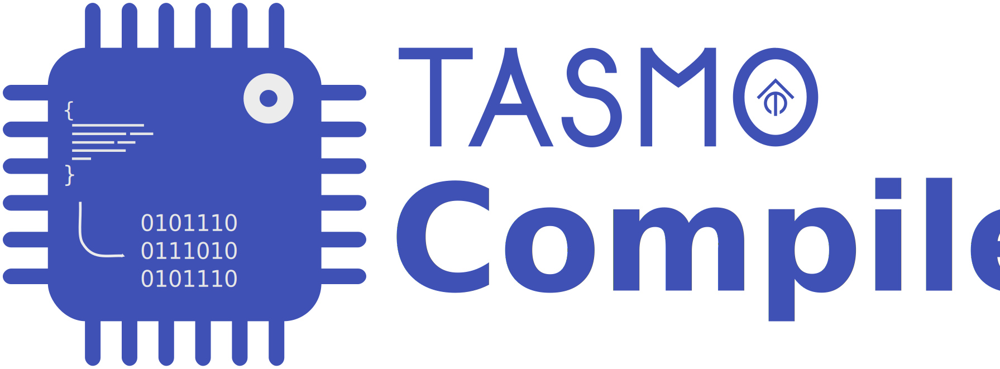
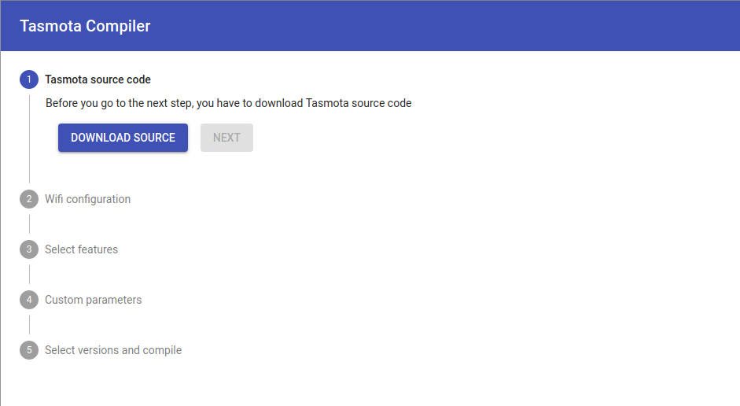
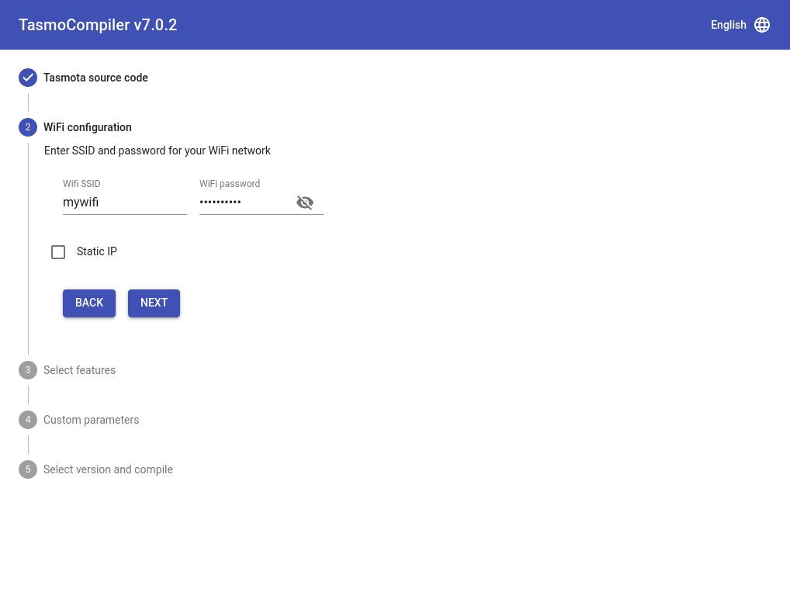
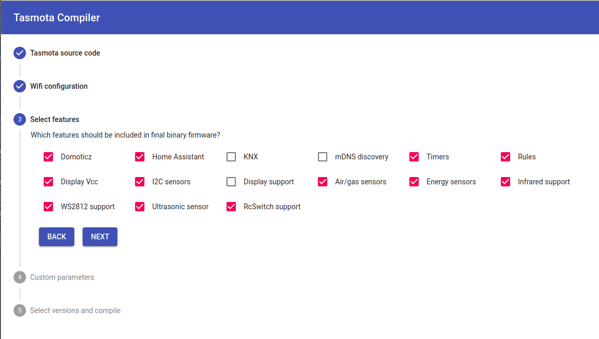
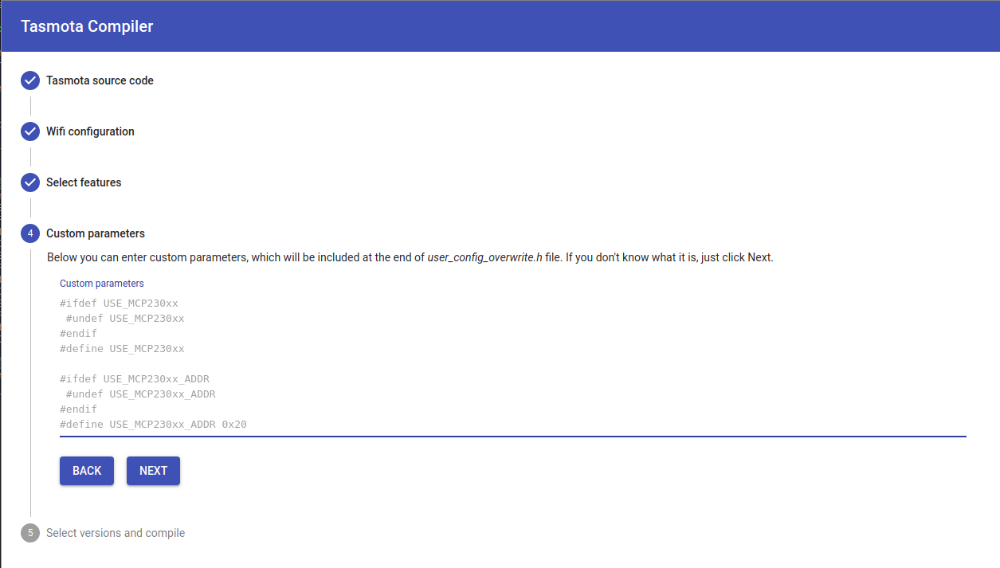
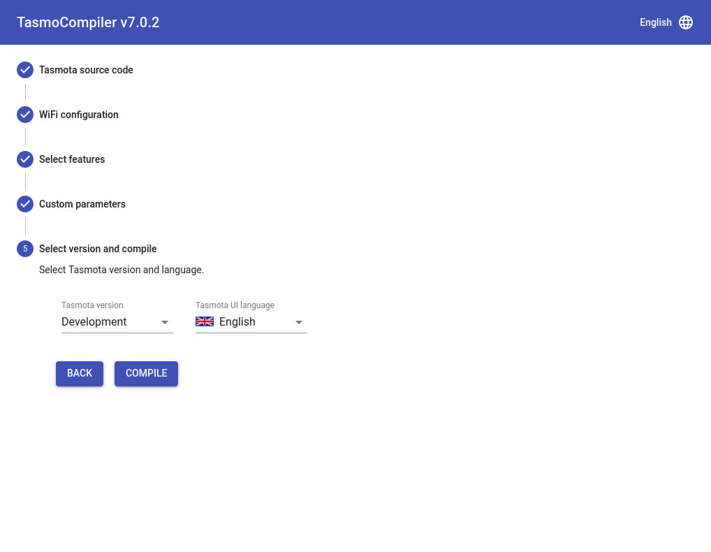
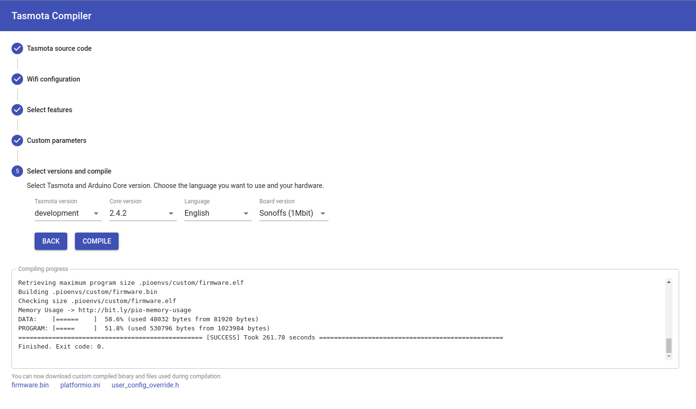
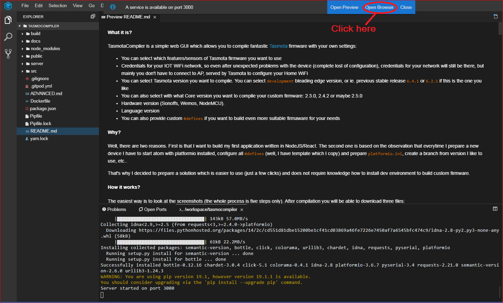

[](https://www.paypal.me/tasmocompiler)
[](https://ko-fi.com/benzino77)


<!--  -->

<div align="center">
  
</div>

#### What it is?

TasmoCompiler is a simple web GUI which allows you to compile fantastic [Tasmota](https://github.com/arendst/Sonoff-Tasmota) firmware with your own settings:

- You can select which board you are building firmware for
- You can select which features/sensors of Tasmota firmware you want to use (description of available features can be found in [FEATURES DESCRIPTION](https://github.com/benzino77/tasmocompiler/blob/master/FEATURES_DESC.md) file)
- Credentials for your IOT WiFi network, so even after unexpected problems with the device (complete lost of configuration), credentials for your network will still be there, but mainly you don't have to connect to AP, served by Tasmota to configure your Home WiFi
- You can select Tasmota version you want to compile. You can select `development` bleading edge version, or latest stable release if this is the one you like
- Language of Tasmota GUI interface
- You can also provide custom `#defines` if you want to build even more suitable firmaware for your needs

#### Why?

Well, there are two reasons. First is that I want to build my first application written in NodeJS/React. The second one is based on the observation that everytime I prepare a new device I have to start atom with platformio installed, configure all `#defines` (well, I have template which I copy) and prepare `platformio.ini`, create a branch from version I like to use, etc..

That's why I decided to prepare a solution which is easier to use (just a few clicks) and does not require knowledge how to install dev environment to build custom firmware.

#### How it works?

The easiest way is to look at the screenshots (the whole process is five steps only). After compilation you will be able to download four (or three for ESP32 boards) files:

1. Your new `firmware.bin` file, which can be uploaded to your device via Tasmota WebGUI, espotool, ESPEasy flasher or any other tool you used to use to flash your device
2. Compressed file `firmware.bin.gz` (not available for ESP32 boards)
3. `platformio_override.ini` file, to check what options for platformio were used to compile the custom firmware file
4. `user_config_override.h` file to check what features are included/excluded from resulting firmware

The links to download these files will show up under _Compiling progress_ field (look at the bottom of the last screenshot). **These links will show up only when compilation is successful**.

You have to upload only `firmware.bin` or `firmware.bin.gz` file to your device. How to do that is perfeclty described on [Tasmota docs](https://tasmota.github.io/docs/Upgrading/).








#### How to start using TasmoCompiler?

##### Super easy way (Thanks to @meingraham and @Jason2866)

Click this [link to Gipod](https://gitpod.io/#https://github.com/benzino77/tasmocompiler). You have to have [Github](https://github.com) account and authorize Gitpod to access it. If you don't have it, it is just few clicks to create account on Github. After a while new browser tab should open with TasmoCompiler. If you have pop-up blocked in your browser you will have to accept the new tab open (1 and 2). If the new tab does not open or you cannot see the pop-up notification, click on the _Ports view_ link (3) and then on _Open browser_ (4):



###### Note

You have to remember that all compilation is performed on Gitpod servers, so you have to decide if you want to put sensitive data like Wifi/MQTT credentials to Gitpod hands :see_no_evil: :hear_no_evil: :speak_no_evil:

##### Easy way

Start TasmoCompiler in docker:

`docker pull benzino77/tasmocompiler`

`docker run --rm --name tasmocompiler -p 3000:3000 benzino77/tasmocompiler`

Then point your browser to http://localhost:3000

If you want to see debug messages on docker console you can run a container with env variable:

`docker run --rm --name tasmocompiler -p 3000:3000 -e DEBUG=server,git,compile benzino77/tasmocompiler`

- `server` to see http server messages
- `git` to see git operation messages
- `compile` to see messages during compilation

You can also specify different port on which TasmoCompiler will be available on the host:

`docker run --rm --name tasmocompiler -p 8080:3000 benzino77/tasmocompiler`

Then point your browser to http://localhost:8080

##### Less easy way

1. Install `NodeJS` and `Python 3.6.x` or later
2. Install [`yarn`](https://yarnpkg.com/en/docs/install)
3. Install [`platformio`](https://docs.platformio.org/en/latest/installation.html)
4. Clone/download the repository from github and change directory to the cloned repo
5. run `yarn install`
6. run `yarn build`
7. run `node server/app.js`
8. point your browser to http://localhost:3000

#### How to use "Custom parameters"?

The configuration options are limited on purpose. I don't want to _overload_ the GUI with too many options. But there is _Custom prameters_ step which allows you to define other Tasmota parameters. Let's say you want to define your MQTT broker and credentials for it. You have to put these lines in _Custom parameters_ field:

```C++
#ifdef MQTT_HOST
  #undef MQTT_HOST
#endif
#define MQTT_HOST               "mqtt.yourhost.iot"

#ifdef MQTT_PORT
  #undef MQTT_PORT
#endif
#define MQTT_PORT               1883

#ifdef MQTT_USER
  #undef MQTT_USER
#endif
#define MQTT_USER            "mqttuser"

#ifdef MQTT_PASS
  #undef MQTT_PASS
#endif
#define MQTT_PASS            "mqttpassword"
```

To define _Friendly name_ for your device you have to put these lines in _Custom parametrs_ field:

```C++
#ifdef FRIENDLY_NAME
  #undef FRIENDLY_NAME
#endif
#define FRIENDLY_NAME          "Watering controller"

```

Let's assume that you want to _compile in_ information about your ntp server, your time zone and location (this is used by timers for events like _sunrise/sunset_). You can do this by putting these lines in _Custom parameters_ field:

```C++
#ifdef NTP_SERVER1
  #undef NTP_SERVER1
#endif
#define NTP_SERVER1             "ntp.yourserver.iot"

#ifdef LATITUDE
  #undef LATITUDE
#endif
#define LATITUDE               34.4348

#ifdef LONGITUDE
  #undef LONGITUDE
#endif
#define LONGITUDE              10.0508

#ifdef APP_TIMEZONE
  #undef APP_TIMEZONE
#endif
#define APP_TIMEZONE           99
```

You can find additional information what can be set by _Custom parameters_ field in [my_user_config.h](https://github.com/arendst/Tasmota/blob/development/tasmota/my_user_config.h) in Tasmota source code.

#### Troubleshooting and advanced usage

If you have problems with the compiler or you are interested in more advance usage, please refer to the [ADVANCED](https://github.com/benzino77/tasmocompiler/blob/master/ADVANCED.md) tips for more information.

#### Development version

There is a TasmoCompiler branch which tries to follow as much as possible changes made to `development` branch of Tasmota. It is bleeding edge version so you can expect unexpected. To use `development` version of TasmoCompiler go to gitpod using this [link](https://gitpod.io/#https://github.com/benzino77/tasmocompiler/tree/development) or pull and run appriopriate docker image:

`docker run --rm --name tasmocompiler -p 3000:3000 benzino77/tasmocompiler:development`

#### Disclaimer

Everything you do, you do on your own responsibility. I do not take any responsibility for damages or problems, that may arise as a result of using this solution or its products.

##### Credits

Thanks to [Theo Arends](https://github.com/arendst) and the entire Tasmota Dev Team for fantastic work!

#### License

TasmoCompiler is licensed under the [MIT license](LICENSE).
