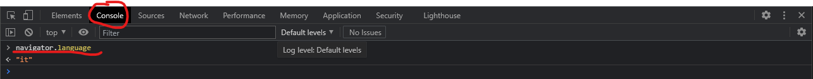
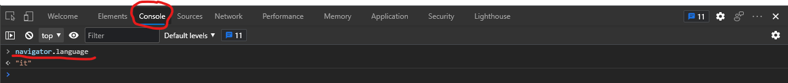
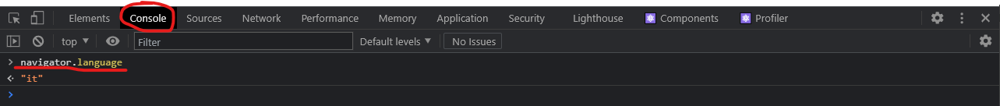

#### How to prepare TasmoCompiler web interface translation

1. copy `src/locales/en.json` file to `<your_language_code>.json` (for example create `it.json` file to create Italian translation)
2. translate english text to your language:

##### before:

```javascript
...
"stepWifiConfDesc": "Enter SSID and password for your WiFi network",
...
```

##### after:

```javascript
...
"stepWifiConfDesc": "YOUR TRANSLATION GOES HERE",
...
```

3. edit `src/locales/language.js` file and add your language

##### before:

```javascript
import localeEN from '../locales/en.json';
import localeES from '../locales/es.json';
import localePL from '../locales/pl.json';

const allMessages = {
  de: {
    source: localeDE,
    nativeName: 'Deutsch',
    flag: 'flags/de.png',
    browserLang: ['de', 'de-de'],
  },
  en: {
    source: localeEN,
    nativeName: 'English',
    flag: 'flags/gb.png',
    browserLang: ['en', 'en-gb', 'en-us'],
  },
  es: {
    source: localeES,
    nativeName: 'Español',
    flag: 'flags/es.png',
    browserLang: ['es', 'es-es'],
  },
};
```

##### after:

```javascript
import localeEN from '../locales/en.json';
import localeES from '../locales/es.json';
import localePL from '../locales/pl.json';
import localeIT from '../locales/it.json'; // add this line

const allMessages = {
  de: {
    source: localeDE,
    nativeName: 'Deutsch',
    flag: 'flags/de.png',
    browserLang: ['de', 'de-de'],
  },
  en: {
    source: localeEN,
    nativeName: 'English',
    flag: 'flags/gb.png',
    browserLang: ['en', 'en-gb', 'en-us'],
  },
  es: {
    source: localeES,
    nativeName: 'Español',
    flag: 'flags/es.png',
    browserLang: ['es', 'es-es'],
  },
  // add this property
  it: {
    source: localeIT,
    nativeName: 'Italiano',
    flag: 'flags/it.png',
    browserLang: ['it'],
  },
};
```

#### How to find values to be added to `browserLang` list?

Open Firefex, Chrome, Edge, Brave, Opera, any other browser you have installed and press `F12` key. It will open `developmer tools`. Choose `console` and type: `navigator.language`. You should type this in the console of as many browsers as you can - some browsers have different language code than others.

##### Firefox


##### Chrome



##### Edge



##### Brave



#### Flag

The flag should be placed in `public/flags` folder. It should be 24px wide and PNG format.
